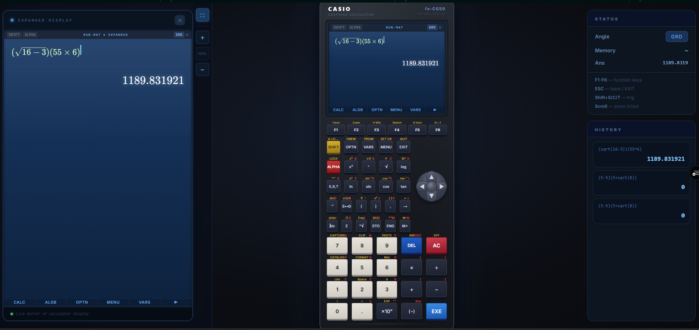

<h1 align="center">Advanced Casio-Style Calculator</h1>

<p align="center">
  
</p>

<p align="center">
  
  
  
  
  
  
</p>

An interactive graphing and scientific calculator inspired by the Casio fx-CG50. The project combines a physical calculator interface with dedicated tools for numerical calculation, graphing, tables, equations, matrices, vectors, statistics, and in-browser Python execution.

The interface supports mouse, touch, and keyboard input. Calculator state, history, memory, graph equations, and Python files are retained locally where applicable.

## Highlights

- Casio-inspired body, LCD, keypad, directional pad, modifier keys, and contextual `F1-F6` menus.
- Draggable calculator with controlled zoom and an optional expanded display.
- Angle modes: degrees, radians, and gradians.
- Expression history, answer memory, calculator memory, and variable support.
- Symbolic algebra backed by Nerdamer.
- Numerical evaluation backed by Math.js and the local expression parser.
- Real Python execution in the browser through Pyodide.
- Responsive, full-screen workspaces for each advanced mode.

## Calculator Modes

| Mode | Capabilities |
| --- | --- |
| **RUN-MAT** | Scientific expressions, trigonometry, logarithms, roots, fractions, memory, answer recall, contextual calculation and algebra menus. |
| **GRAPH** | Multiple color-coded equations, visibility controls, interactive plotting, pan, zoom, and trace-oriented controls. |
| **TABLE** | Generates values for `f(x)` over a configurable start, end, and step range. |
| **EQUATION** | Linear solver, polynomial roots, and simultaneous systems with two or three variables. |
| **MATRIX** | Matrix addition, subtraction, multiplication, transpose, determinant, inverse, and rank. |
| **VECTOR** | `Vct A` and `Vct B` editing with dot product, cross product, norm, unit vector, angle, and addition. |
| **STAT** | One-variable statistics, paired data, linear regression, histogram, and scatter visualization. |
| **PYTHON** | Multi-file `.py` editor, persistent files, shell output, tab indentation, and real execution using Pyodide. |

## Function Menus

The RUN-MAT display uses contextual soft keys connected to the physical `F1-F6` row. Available groups include:

- `CALC`: integration, differentiation, solving, and summation templates.
- `ALGB`: simplify, factor, expand, and solve through Nerdamer.
- `OPTN`: list, matrix/vector, complex, statistics, probability, numeric, and angle-related groups.
- `VARS`: answer, memory, and variable insertion.
- Additional memory and angle controls on the next soft-key page.

The on-screen soft-key labels can also be clicked directly.

## Python Editor

Python mode provides an editor and output shell inside the calculator application:

- Create, switch, save, and delete Python files.
- Run the active file with the `RUN` command or `Ctrl+Enter`.
- Insert four spaces with `Tab` without leaving the editor.
- Capture standard output and standard error in the shell.
- Persist saved files in browser local storage.

Pyodide is initialized only when Python is executed for the first time. The first run may take longer while the runtime is loaded.

## Keyboard Controls

| Key | Action |
| --- | --- |
| `0-9`, `.`, operators | Enter numbers and arithmetic operations. |
| `Enter` | Execute the current expression or confirm a menu selection. |
| `Backspace` | Delete the previous character. |
| `Escape` | Exit the current menu or return to the previous calculator view. |
| Arrow keys | Navigate calculator menus and supported screens. |
| `F1-F6` | Trigger the contextual function shown above the corresponding key. |
| `Ctrl+Enter` | Run the active file in Python mode. |
| Mouse wheel | Zoom the calculator while the calculator canvas is focused. |

## Technology Stack

### Application

- [Next.js 16](https://nextjs.org/) with the App Router
- [React 19](https://react.dev/)
- [TypeScript](https://www.typescriptlang.org/)
- [Tailwind CSS 4](https://tailwindcss.com/)
- [Framer Motion](https://www.framer.com/motion/) for interface transitions
- [Lucide React](https://lucide.dev/) for interface icons
- [Zustand](https://zustand.docs.pmnd.rs/) for persisted calculator state
- [Desmos API](https://www.desmos.com/api/v1.11/docs/index.html) for the interactive graphing surface

### Math and Runtime

- [Math.js](https://mathjs.org/) for numerical expression evaluation
- [Nerdamer](https://nerdamer.com/) for symbolic algebra and equation solving
- [jStat](https://jstat.github.io/) for statistical calculations
- [MathLive](https://mathlive.io/) and [KaTeX](https://katex.org/) for mathematical input and rendering support
- [Pyodide](https://pyodide.org/) for Python execution through WebAssembly

## Getting Started

### Requirements

- Node.js 20.9 or newer
- [pnpm](https://pnpm.io/)

### Installation

```bash
pnpm install
```

### Development

```bash
pnpm dev
```

Open `http://localhost:3000` in a browser.

### Production Build

```bash
pnpm build
pnpm start
```

### Linting

```bash
pnpm lint
```

## Project Structure

```text
advanced-calculator/
|-- app/                    # Next.js entry points and global styling
|-- components/
|   |-- app/                # Main application shell and mode routing
|   |-- calculator/         # Calculator body, keypad, and key behavior
|   |-- display/            # Casio-style LCD and menu screens
|   |-- graph/              # Interactive graph mode
|   |-- matrix/             # Matrix workspace
|   |-- modes/              # Table, Python, and calculator modes
|   |-- statistics/         # Statistics workspace and visualizations
|   `-- vector/             # Vector memory and operations
|-- lib/
|   |-- cas/                # Symbolic algebra wrappers
|   |-- math/               # Numerical calculation engine
|   |-- parser/             # Lexer, parser, AST, and evaluator
|   |-- state/              # React state providers
|   `-- vector/             # Vector operation utilities
|-- public/                 # Static images and assets
|-- store/                  # Persisted Zustand calculator store
`-- types/                  # Shared TypeScript declarations
```

## State and Persistence

The application stores calculator preferences and working data in browser local storage. Persisted data includes angle mode, memory, history, graph equations, the last answer, and explicitly saved Python files.

No server-side database or user account is required.

## Verification

Before submitting changes, run:

```bash
pnpm lint
pnpm build
```

The production build performs Next.js compilation, TypeScript validation, and static page generation.

## Notes

- Python runs locally in the browser through WebAssembly; it is not executed on an application server.
- Browser storage is scoped to the current origin and can be cleared by the user.
- The interface is inspired by the Casio fx-CG50 but is an independent software project and is not affiliated with or endorsed by Casio.

## License

This repository does not currently declare an open-source license. All rights remain with the repository owner unless a license is added.
